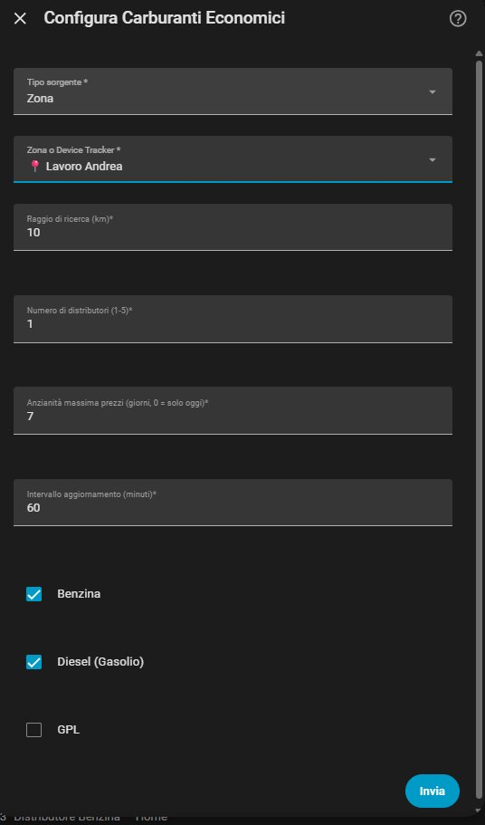
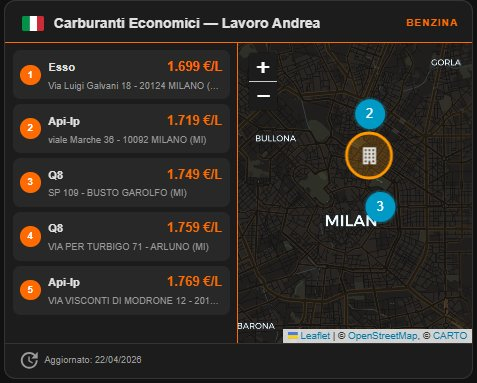

# Carburanti Economici Italia ⛽🇮🇹

[](https://github.com/hacs/integration)
[](https://github.com/ivhazu/carburanti_economici_ha/releases)
[](LICENSE)
[](https://www.home-assistant.io/)

**Carburanti Economici Italia** è una custom integration per Home Assistant che trova e mostra in tempo reale i distributori di carburante più economici nelle vicinanze di qualsiasi zona o dispositivo tracciato, usando i dati ufficiali del Ministero delle Imprese e del Made in Italy (MIMIT).

> 🤖 **Nota:** Questa integrazione è stata sviluppata interamente da [Claude](https://claude.ai) (Anthropic). Il merito dell'idea, del testing e della pubblicazione va a [@ivhazu](https://github.com/ivhazu).

---

## 📸 Screenshot

| Configurazione | Card Lovelace |
|:-:|:-:|
|  |  |

*Interfaccia di configurazione UI e card Lovelace con mappa e lista distributori.*

---

## ✨ Funzionalità

- 📍 **Zone e Device Tracker** — cerca il distributore più vicino a qualsiasi zona HA (casa, lavoro, ecc.) oppure segui in tempo reale la posizione di un veicolo o persona tramite `device_tracker`
- ⛽ **3 tipi di carburante** — Benzina, Diesel (Gasolio) e GPL, selezionabili individualmente
- 🏆 **Fino a 5 distributori** — importa i primi N distributori per prezzo, con entity separate per ciascuno
- 📏 **Raggio configurabile** — da 1 a 50 km
- 🕒 **Intervallo aggiornamento configurabile** — da 15 minuti a 24 ore
- 📅 **Filtro per anzianità prezzi** — escludi distributori con prezzi non aggiornati da troppo tempo (0 = solo oggi)
- 🔄 **Pulsante aggiornamento manuale** — forza il refresh dei dati in qualsiasi momento
- 🗺️ **Card Lovelace integrata** — mappa con pin numerati + lista prezzi, registrata automaticamente senza configurazione manuale
- 🔧 **Configurazione UI** — nessun YAML da scrivere, tutto configurabile dalla UI grafica di HA

---

## 📊 Dati

I prezzi provengono dall'**API ufficiale MIMIT** (`carburanti.mise.gov.it`), alimentata dai gestori dei distributori in ottemperanza alla Legge n. 99/2009. I prezzi mostrati sono **self-service** ove disponibili, altrimenti il prezzo servito.

---

## 🔧 Entity create

Per ogni combinazione *zona/tracker + carburante + posizione in classifica* vengono create **5 entity**:

| Entity | Descrizione | Esempio |
|--------|-------------|---------|
| `sensor.distributore_1deg_benzina_home_prezzo` | Prezzo (€/L) | `1.689` |
| `sensor.distributore_1deg_benzina_home_nome` | Nome stazione | `ENI Via Roma` |
| `sensor.distributore_1deg_benzina_home_indirizzo` | Indirizzo + coordinate | `Via Roma 1, Milano` |
| `sensor.distributore_1deg_benzina_home_marchio` | Marchio | `ENI` |
| `sensor.distributore_1deg_benzina_home_aggiornamento` | Data ultimo aggiornamento prezzi | timestamp |

Il sensore `_indirizzo` espone gli attributi `latitude` e `longitude`, compatibili con la card `map` nativa di HA.

Viene inoltre creato un **pulsante** per ogni istanza:

| Entity | Descrizione |
|--------|-------------|
| `button.aggiorna_carburanti_home` | Forza il refresh immediato dei dati |

---

## 🗺️ Card Lovelace

La card viene **registrata automaticamente** all'avvio dell'integrazione — nessun file da copiare in `www/`, nessuna risorsa da aggiungere manualmente (eccetto la prima volta, vedi installazione).

La card mostra:
- 🇮🇹 Intestazione con bandiera italiana, nome zona/tracker e tipo carburante
- Lista distributori con marchio, prezzo e indirizzo
- Mappa con pin numerati e zona/tracker di riferimento
- Data dell'ultimo aggiornamento prezzi

**Configurazione YAML minima:**
```yaml
type: custom:carburanti-economici-card
entities:
  - sensor.distributore_1deg_benzina_home_prezzo
  - sensor.distributore_2deg_benzina_home_prezzo
  - sensor.distributore_3deg_benzina_home_prezzo
```

L'editor grafico è disponibile direttamente dalla UI di HA.

---

## 📦 Installazione

### Via HACS (consigliato)

1. Apri HACS in Home Assistant
2. Vai in **Integrazioni** → menu ⋮ → **Repository personalizzati**
3. Aggiungi `https://github.com/ivhazu/carburanti_economici_ha` come tipo **Integrazione**
4. Cerca **Carburanti Economici Italia** e clicca **Scarica**
5. Riavvia Home Assistant
6. Vai in **Impostazioni → Dashboard → Risorse** e aggiungi:
   - URL: `/carburanti_economici/carburanti-economici-card.js`
   - Tipo: **Modulo JavaScript**
7. Riavvia la pagina con `Ctrl+Shift+R`

### Installazione manuale

1. Scarica l'ultima release da [GitHub Releases](https://github.com/ivhazu/carburanti_economici_ha/releases)
2. Estrai e copia la cartella `custom_components/carburanti_economici/` in `config/custom_components/`
3. Riavvia Home Assistant
4. Vai in **Impostazioni → Dashboard → Risorse** e aggiungi:
   - URL: `/carburanti_economici/carburanti-economici-card.js`
   - Tipo: **Modulo JavaScript**
5. Riavvia la pagina con `Ctrl+Shift+R`

---

## ⚙️ Configurazione

1. Vai in **Impostazioni → Dispositivi e Servizi → Aggiungi integrazione**
2. Cerca **Carburanti Economici Italia**
3. Configura:

| Campo | Descrizione | Default |
|-------|-------------|---------|
| **Tipo sorgente** | Zona HA o Device Tracker | Zona |
| **Zona / Device Tracker** | L'entità da cui prendere le coordinate | — |
| **Raggio (km)** | Raggio di ricerca distributori | 10 |
| **N° distributori** | Quanti distributori importare (1-5) | 1 |
| **Anzianità prezzi (giorni)** | Escludi prezzi più vecchi di X giorni (0 = solo oggi) | 7 |
| **Intervallo aggiornamento (min)** | Frequenza di aggiornamento automatico | 60 |
| **Benzina** | Abilita ricerca benzina | ✅ |
| **Diesel** | Abilita ricerca diesel | ✅ |
| **GPL** | Abilita ricerca GPL | ❌ |

Puoi aggiungere **più istanze** per monitorare zone o veicoli diversi.

---

## 📋 Requisiti

- Home Assistant **2023.1.0** o superiore
- Connessione internet
- Almeno una **Zona** configurata in HA oppure un **Device Tracker** con coordinate GPS

---

## 🐛 Problemi noti

- I prezzi mostrati dipendono dalla frequenza di aggiornamento dei gestori. Alcuni distributori potrebbero avere prezzi non aggiornati — usa il filtro **anzianità prezzi** per escluderli.
- La card Lovelace richiede la registrazione manuale della risorsa JS (solo al primo avvio, una volta sola).

---

## 🤝 Contributi

PR e issue sono benvenuti! Apri una issue per segnalare bug o proporre nuove funzionalità.

---

## 📄 Licenza

MIT License — vedi [LICENSE](LICENSE)

---

## 🙏 Ringraziamenti

- **[MIMIT](https://www.mimit.gov.it/)** per l'API pubblica dei prezzi carburanti
- **[Claude (Anthropic)](https://claude.ai)** per lo sviluppo dell'integrazione
- **[@ivhazu](https://github.com/ivhazu)** per testing, feedback e pubblicazione
